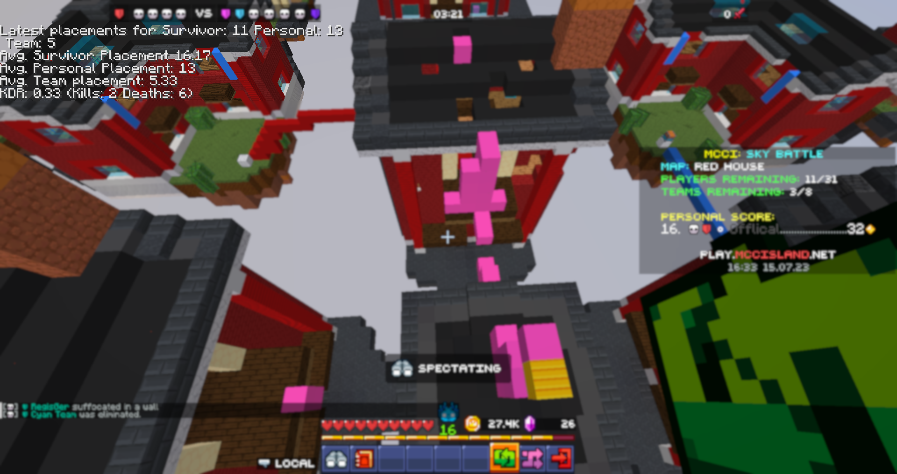
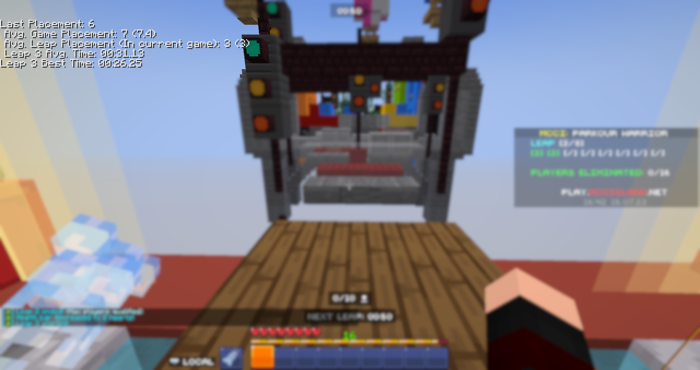
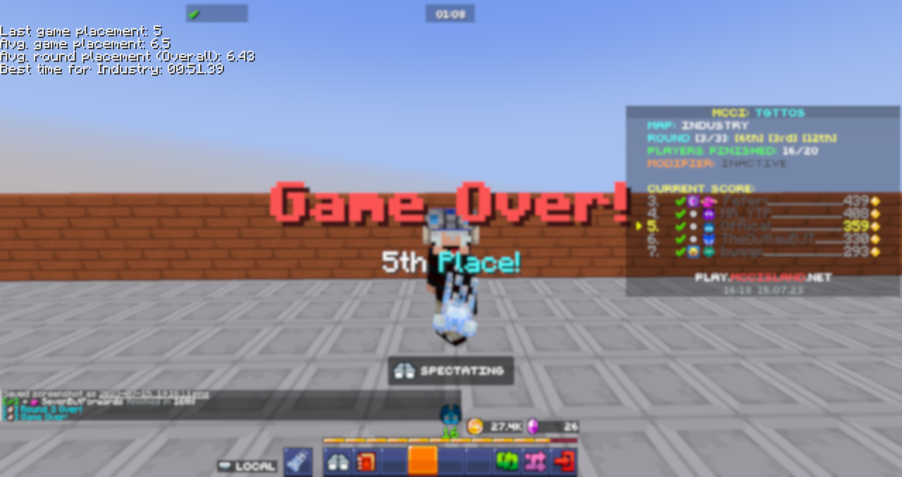
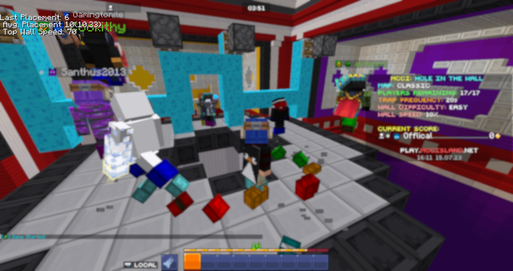

<h1 align="center">
<picture></img></picture>
 
 MCCI Stats Tracker 
 </h1>
 
 

A minecraft fabric mod, that uses game features to track your stats in those games.

**NOTE: As of this early version, there isn't any configuration, Will be improving & adding later on**

* [What stats are being tracked for ___?](#what-stats-are-being-tracked-for)
* [Screenshots](#screenshots)
* [Future Plans? / TODO](#future-plans--todo)
* [Are my stats local?](#are-my-stats-local)

Currently, the mod tracks every game but the Dojo, especially because it's a solo mode so it's lower priority.
Realistically, this mod will become irrelevant the moment Noxcrew releases an actual stats viewer, but I thought I'd still try and make something that works for now. plus there might be a use for this to track stats that Noxcrew may not track/show on the theoretic future stats viewer.

## What stats are being tracked for ____?
Here's a full list of what stats are being tracked for each game.

| Game     | Stats Tracked |
| ----------- | ----------- |
| Battle Box      | Kills, Deaths, KDR (Kill/Death ratio), Round Wins, Losses, WLR (Win/Loss Ratio), Last & Average personal, same for team placement.       |
| Sky Battle | Kills, Deaths, KDR (Kill/Death ratio), Average & Last for survivor, personal and team placements.
| Parkour Warrior Survivor | Average Leap Placements (In current game), Average Game Placements, Average & Best Time per Leap (Leap 1, 2, 3.. etc), Last game placement
| TGTTOS (To Get To The Other Side)   | Average for round placements, game placements, Best completion/whack time for current map, last game placement         |
| Hole In The Wall | Last & Average Game Placement, Top Wall Speed survived, 

## Are my stats local?
Yes! (technically, MCC still collects some of that data) but all of the data from this mod is saved locally only, you can find the stats in the mcci-stats folder of the minecraft directory (.minecraft)

## Screenshots

*I'm not great at pvp games but I try.*

*Parkour Warrior Survivor is more my jam though.*

*Wow it works!*

## Future Plans / TODO
- [x] Tracking & Detection of all games's stats 
- [x] Saved stats to JSON files locally
- [ ] Configuration of UI placement, colors & size
- [ ] Messages / Pop-ups for improvements / worsens of stats (Average going down/up)
- [ ] Internal/External Graph viewer to show stats change over time?
- [ ] OBS Overlay Integration?
